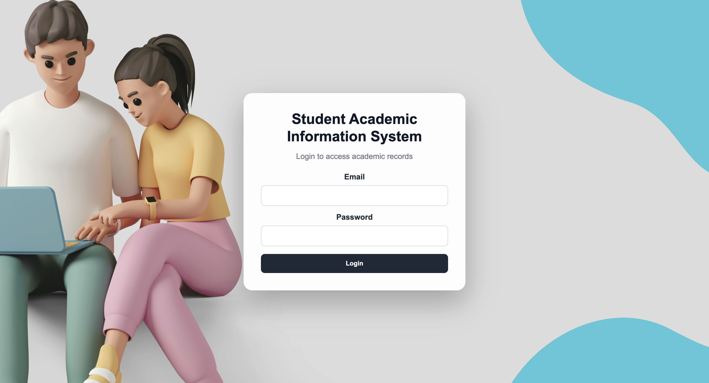
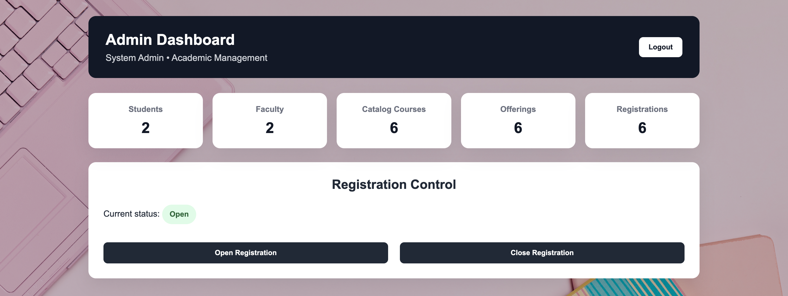
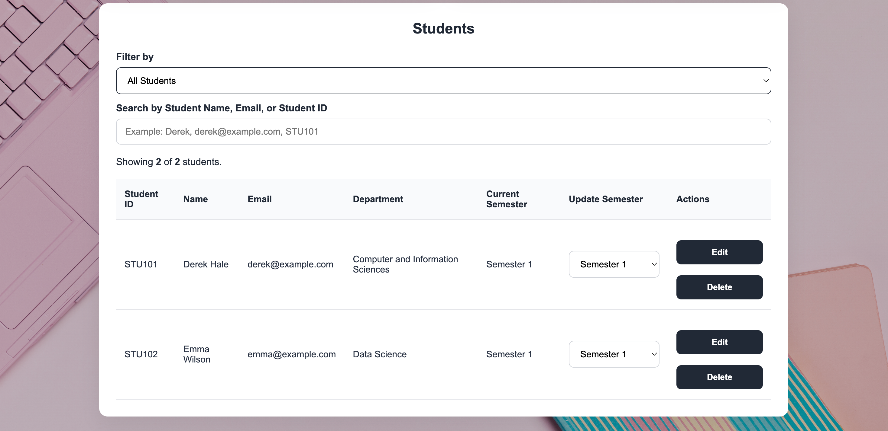
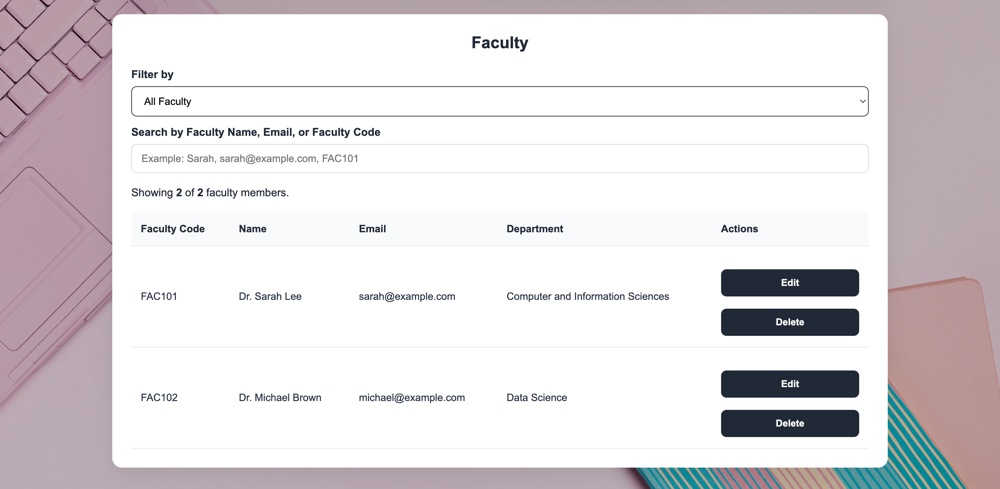
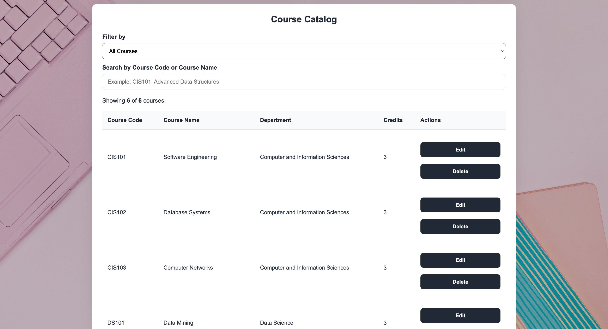
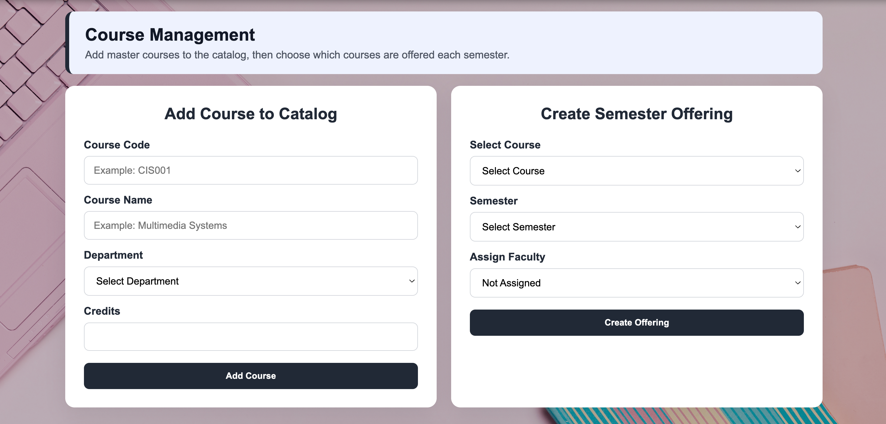
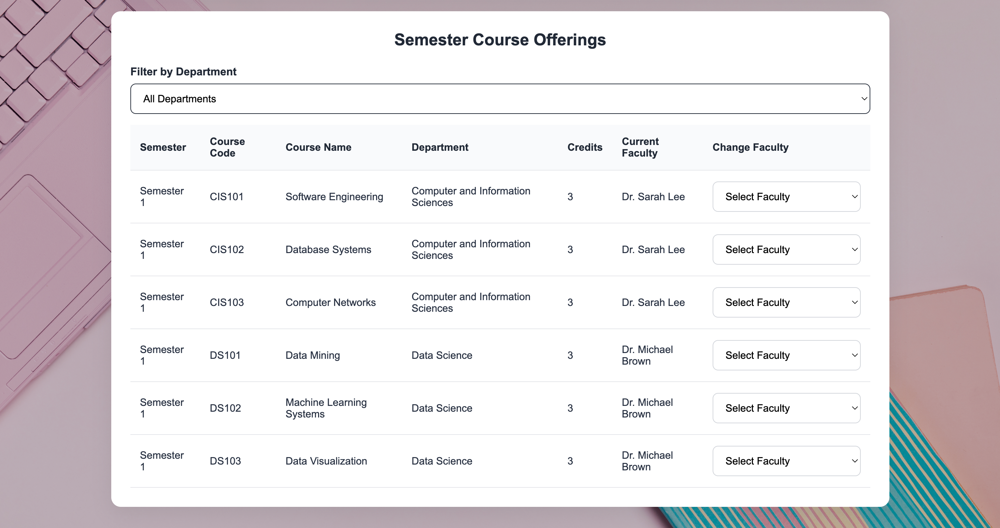
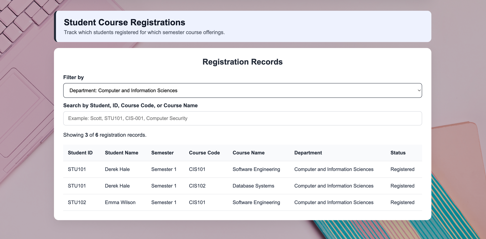
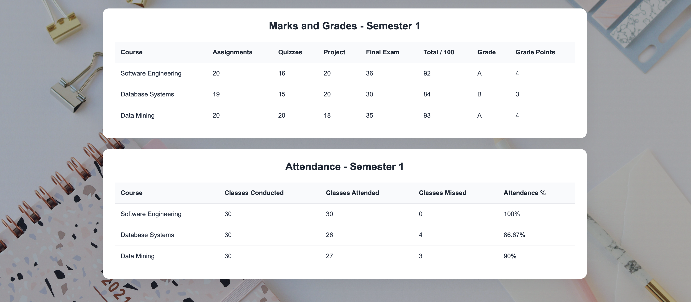
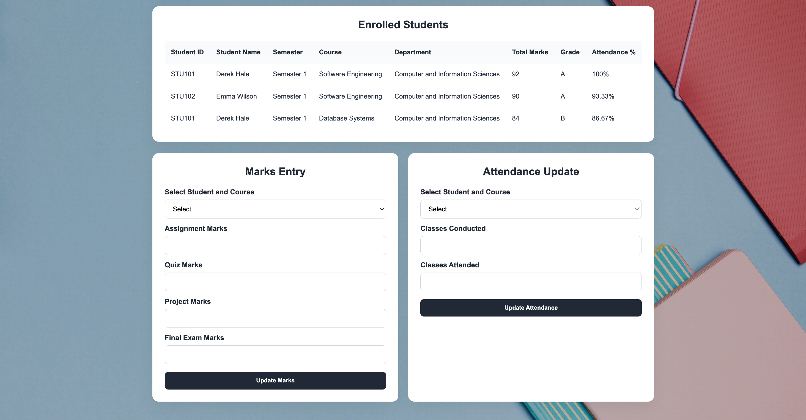

# Student Academic Information System

This project is a full-stack web application that manages academic information for students, faculty, and administrators. It provides role-based dashboards for course registration, semester course offerings, faculty assignment, marks entry, attendance tracking, GPA/CGPA calculation, and transcript generation.

The system was built using React for the frontend, Node.js and Express.js for the backend, and SQLite for local database storage.

## Features

- Role-based login for Admin, Faculty, and Student users
- Admin dashboard for managing students, faculty, courses, semester offerings, and registration records
- Student and faculty record management with create, view, edit, delete, search, and filter options
- Course catalog management with semester-based course offering creation
- Faculty assignment to course offerings with department-based validation
- Registration open/close control managed by the admin
- Student course registration based on semester and department constraints
- Duplicate course registration prevention across semesters
- Semester progression validation based on completed course requirements
- Faculty dashboard for viewing assigned courses and enrolled students
- Marks and attendance entry by faculty for assigned courses
- Automatic grade, semester GPA, overall CGPA, attendance percentage, and total credits calculation
- Student dashboard for viewing profile, registered courses, grades, attendance, GPA, and CGPA
- Downloadable academic transcript generated as a PDF
- Historical course department and faculty details preserved in student academic records


## Tech Stack

### Frontend

* React
* Vite
* JavaScript
* CSS
* jsPDF
* jsPDF AutoTable

### Backend

* Node.js
* Express.js
* SQLite
* bcryptjs
* CORS

### Tools

* VS Code
* Git
* GitHub
* npm

## Project Files

```text
backend/database.js - Database setup, table creation, helper functions, and default admin creation.
backend/server.js - Express backend server containing API routes for authentication, admin, faculty, and student operations.
frontend/src/App.jsx - Main React application with role-based dashboards and frontend logic.
frontend/src/App.css - Styling for login page, dashboards, cards, forms, tables, modals, and backgrounds.
frontend/src/api.js - API configuration for backend communication.
screenshots/ - Project screenshots used in the README.
sample-output/student-transcript.pdf - Sample generated student transcript.
```

## How to Run Locally

### 1. Clone the repository

```bash
git clone https://github.com/Sathvika1802/student-academic-information-system.git
cd student-academic-information-system
```

Replace `your-username` with your GitHub username.

### 2. Install backend dependencies

```bash
cd backend
npm install
```

### 3. Run the backend server

```bash
npm run dev
```

The backend server runs locally on port `5050`.

### 4. Install frontend dependencies

Open a new terminal from the project root and run:

```bash
cd frontend
npm install
```

### 5. Run the frontend

```bash
npm run dev
```

The frontend development server runs locally on port `5173`.

## User Setup

The default admin account is created when the database is initialized. Faculty and student accounts can be created from the Admin Dashboard.

For security reasons, demo passwords are not included in this README.

## Screenshots

### Login Page



### Admin Dashboard



### User Creation


### Student Management



### Faculty Management



### Course Catalog



### Course Management



### Semester Course Offerings



### Registration Records



### Student Course Registration


### Student Dashboard


### Student Grades and Attendance



### Faculty Assigned Courses


### Faculty Marks and Attendance




## Sample Output

A sample generated transcript PDF is included in:

```text
sample-output/student-transcript.pdf
```

## Files Included in GitHub

The repository includes:

```text
backend/database.js
backend/server.js
backend/package.json
backend/package-lock.json
frontend/src/api.js
frontend/src/App.jsx
frontend/src/App.css
frontend/src/index.css
frontend/src/main.jsx
frontend/index.html
frontend/package.json
frontend/package-lock.json
frontend/vite.config.js
frontend/public/
screenshots/
sample-output/
README.md
.gitignore
```

The repository does not include generated or local files such as:

```text
node_modules/
backend/academic.db
.env
.DS_Store
__MACOSX/
dist/
```